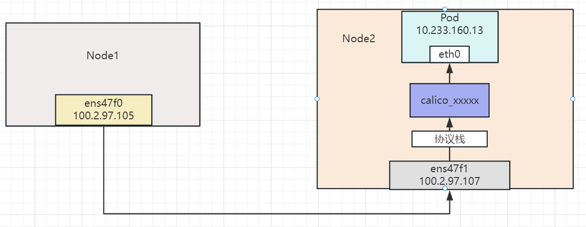
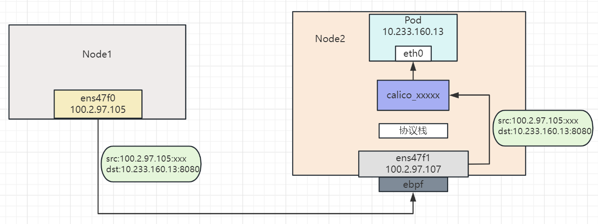
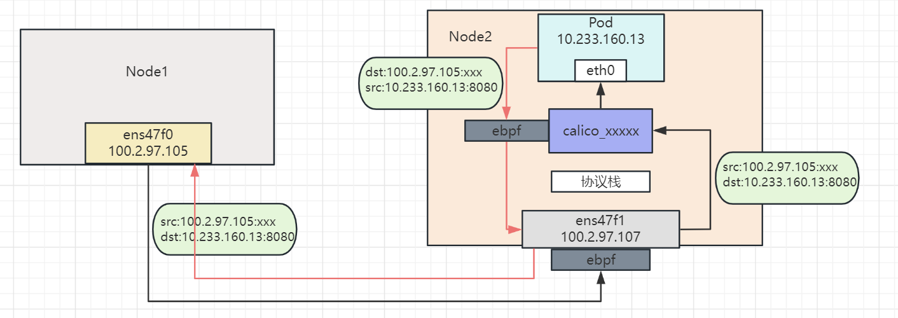

## 简介

本文基于ebpf的redirect函数，在TC位置实现数据包的重定向示例，后续若有相似使用场景可在此基础上修改实现。

## 用户态

用户态主要完成两个功能

**①完成ebpf程序的加载**

用户态程序有一条比较重要的注释如下

`//go:generate go run github.com/cilium/ebpf/cmd/bpf2go -cc clang-14 -cflags $BPF_CFLAGS bpf overlay.c -- -I../headers`

注释部分主要供执行go generate时根据.c文件生成go文件，注意bpf后跟的是ebpf的c文件  -I 后指定头文件所在位置

加载bpf程序编译出的.o文件的代码如下所示，所有通过cilium-ebpf实现的ebpf程序加载过程都可以复用以下代码。

```golang
  `// Load pre-compiled programs into the kernel.`

  `objs := bpfObjects{}`

  `if err := loadBpfObjects(&objs, nil); err != nil {`

​    `log.Fatalf("loading objects failed: %v", err)`

  `}`

  `defer objs.Close()`
```

在该示例中，我们将ebpf程序挂载在TC位置并实现数据包redirect，以下代码为在TC位置挂载ebpf程序实现

```golang
devID, err := net.InterfaceByName(ifaceName)
	if err != nil {
		return nil,fmt.Errorf("could not get interface ID: %w", err)
	}

	qdisc := &netlink.GenericQdisc{
		QdiscAttrs: netlink.QdiscAttrs{
			LinkIndex: devID.Index,
			Handle:    netlink.MakeHandle(0xffff, 0),
			Parent:    netlink.HANDLE_CLSACT,
		},
		QdiscType: "clsact",
	}

	err = netlink.QdiscReplace(qdisc)
	if err != nil {
		return nil,fmt.Errorf("could not get replace qdisc: %w", err)
	}
	

	filter := &netlink.BpfFilter{
		FilterAttrs: netlink.FilterAttrs{
			LinkIndex: devID.Index,
			Parent:    netlink.HANDLE_MIN_INGRESS,
			Handle:    1,
			Protocol:  unix.ETH_P_ALL,
		},
		Fd:           program.FD(),
		Name:         program.String(),
		DirectAction: true,
	}

	if err := netlink.FilterReplace(filter); err != nil {
		return nil, fmt.Errorf("failed to replace tc filter: %w", err)
	}
```

其中，ifaceName为要挂载的网卡名，program为ebpf程序中函数名。上述代码执行完成后，效果类似于执行以下命令结果

```shell
tc add dev [eth0] qdisc
tc filter add dev [eth0] ingress bpf da obj [mybpf.o] sec tc
```

程序退出时要将加载的ebpf程序卸载，代码实现如下

```go
	netlink.QdiscDel(qdisc)
	objs.Close()
```

如果手动执行命令卸载ebpf程序如下

```shell
tc add dev [eth0] qdisc
```

**②在用户态查找宿主机网卡，并将网卡具体信息存储进ebpfMap，key为IP，value为ifindex。**

用户态和内核态如果有数据交互只能通过ebpfMap进行，在本例中，需要在内核态中根据IP信息查询对应的ifIndex，因此需要在用户态遍历宿主机的网卡，并将网卡信息存储进ebpfMap，代码如下所示

```go
   //get interfaces on the host
	ifs , err := net.Interfaces()
	if err!= nil{
		log.Fatalf("get interface failed:%v", err)
	}

	//put the index to ebpfMap
	for _, interf := range ifs{
		addres , er := interf.Addrs()
		if er != nil{
			log.Printf("get interface:%s address failed:%v", interf.Name,er)
			continue
		}
		for _,addre := range addres{
			//get the ip "192.168.1.1/32"
			tempaddrestr := addre.String()
			addrestrs := strings.Split(tempaddrestr,"/")
			//addrestr = "192.168.1.1"
			addrestr := addrestrs[0]
			tempIP := net.ParseIP(addrestr)
			intIP,err := ipv4ToInt(tempIP)
			if err != nil{
				fmt.Printf("convert IP:%s, to int failed:%v\n",addrestr,err )
				continue
			}
			//convert the ip to bigint
			fmt.Printf("ip:%s,intIP:%d,ifindex:%d\n",addrestr,intIP,interf.Index)
			err = objs.IfindexMap.Put(intIP, uint32(interf.Index))
			if err != nil{
				fmt.Printf("put map failed:%v,key:%d,value:%d\n", err,intIP,interf.Index)
			}
		} 

	}
```

需要注意的是，在内核态的数据包中解析出的ip地址为int形式表示，并且存储**为小端格式**，因此在解析到宿主机网卡的IP后还要进行一次转换后才能作为ebpfMap的key。

```
func ipv4ToInt(ipaddr net.IP) (uint32, error) {
	if ipaddr.To4() == nil {
		return 0, fmt.Errorf("the address %s is not an ipv4 address\n", ipaddr)
	}
	return binary.LittleEndian.Uint32(ipaddr.To4()), nil
}
```

另外在调用Put函数更新Map信息时，**如果key或者value为int类型，则必须指明int的位数**，否则会报错。如上方代码中。ifindex本来为int，但要强转成int32


## 内核态

内核态主要解析数据包中的元数据，并根据特定的判断条件将数据包进行redirect。

**①读取数据包元数据：**

tc位置的输入参数为sk_buff，结构体中的数据如下所示

```c
struct __sk_buff {
	__u32 len;
	__u32 pkt_type;
	__u32 mark;
	__u32 queue_mapping;
	__u32 protocol;
	__u32 vlan_present;
	__u32 vlan_tci;
	__u32 vlan_proto;
	__u32 priority;
	__u32 ingress_ifindex;
	__u32 ifindex;
	__u32 tc_index;
	__u32 cb[5];
	__u32 hash;
	__u32 tc_classid;
	__u32 data;
	__u32 data_end;
	__u32 napi_id;

	/* Accessed by BPF_PROG_TYPE_sk_skb types from here to ... */
	__u32 family;
	__u32 remote_ip4;	/* Stored in network byte order */
	__u32 local_ip4;	/* Stored in network byte order */
	__u32 remote_ip6[4];	/* Stored in network byte order */
	__u32 local_ip6[4];	/* Stored in network byte order */
	__u32 remote_port;	/* Stored in network byte order */
	__u32 local_port;	/* stored in host byte order */
	/* ... here. */

	__u32 data_meta;
	__bpf_md_ptr(struct bpf_flow_keys *, flow_keys);
	__u64 tstamp;
	__u32 wire_len;
	__u32 gso_segs;
	__bpf_md_ptr(struct bpf_sock *, sk);
	__u32 gso_size;
	__u8  tstamp_type;
	__u32 :24;		/* Padding, future use. */
	__u64 hwtstamp;
};
```

读取数据包元数据主要代码如下

```
  void *data = (void *)(long)skb->data;
  void *data_end = (void *)(long)skb->data_end;
  
  //eth header
  struct ethhdr *eth = data;
  if ((void *)(eth + 1) > data_end) 
  {
      return TC_ACT_OK;
  }
  
  //ip header
  struct iphdr *iph = (struct iphdr *)(eth + 1);
  if ((void *)(iph + 1) > data_end)
  {
  return TC_ACT_OK;
  }
  
  //tcp header
  struct tcphdr *tcp = (struct tcphdr *)(iph + 1);
  if ((void *)(tcp + 1) > data_end)
  {
  return TC_ACT_OK;
  } 
  
```

逻辑比较简单，根据网络分层进行协议解析，各层头部的信息如下

```c
/*
 *	This is an Ethernet frame header.
 */

struct ethhdr {
	unsigned char	h_dest[ETH_ALEN];	/* destination eth addr	*/
	unsigned char	h_source[ETH_ALEN];	/* source ether addr	*/
	__be16		h_proto;		/* packet type ID field	*/
} __attribute__((packed));
```

```c
struct iphdr {
#if defined(__LITTLE_ENDIAN_BITFIELD)
	__u8	ihl:4,
		version:4;
#elif defined (__BIG_ENDIAN_BITFIELD)
	__u8	version:4,
  		ihl:4;
#else
#error	"Please fix <asm/byteorder.h>"
#endif
	__u8	tos;
	__be16	tot_len;
	__be16	id;
	__be16	frag_off;
	__u8	ttl;
	__u8	protocol;
	__sum16	check;
	__be32	saddr;
	__be32	daddr;
	/*The options start here. */
};

```

```c
struct tcphdr {
	__be16	source;
	__be16	dest;
	__be32	seq;
	__be32	ack_seq;
#if defined(__LITTLE_ENDIAN_BITFIELD)
	__u16	res1:4,
		doff:4,
		fin:1,
		syn:1,
		rst:1,
		psh:1,
		ack:1,
		urg:1,
		ece:1,
		cwr:1;
#elif defined(__BIG_ENDIAN_BITFIELD)
	__u16	doff:4,
		res1:4,
		cwr:1,
		ece:1,
		urg:1,
		ack:1,
		psh:1,
		rst:1,
		syn:1,
		fin:1;
#else
#error	"Adjust your <asm/byteorder.h> defines"
#endif	
	__be16	window;
	__sum16	check;
	__be16	urg_ptr;
};
```

解析到元数据后即可根据具体业务逻辑进行处理，本例中解析目的端口为8080的数据包，并将其redirect到目的IP所在网卡。redirect接收的参数为ifindex，所以需要从ebpfMap根据目的IP查询ifIndex

```go
if( bpf_htons(tcp->dest) == 8080)
{
    unsigned int key;
    key = iph->daddr;
    unsigned int *ifindex;
    ifindex = bpf_map_lookup_elem(&ifindex_map, &key);
    if (ifindex)
    {
        bpf_printk("In the ifindex Map,ip:%pI4, ifindex:%d",&key,*ifindex);
        return bpf_redirect(*ifindex,0);
    }
}
```

其中redirect将原始包直接透传至目的网卡，不会修改网络包的任何信息，所以送到目的网卡后由于MAC地址不符合校验规则，因此会在目的网卡中将该数据包丢弃，若要实现重定向并被目的网卡接收，需要调用bpf_redirect_neigh，从该函数的注释也可以看出，它会修改数据包的二层信息。

```c
 * 	Redirect the packet to another net device of index *ifindex*
 * 	and fill in L2 addresses from neighboring subsystem. This helper
 * 	is somewhat similar to **bpf_redirect**\ (), except that it
 * 	populates L2 addresses as well, meaning, internally, the helper
 * 	relies on the neighbor lookup for the L2 address of the nexthop.
```
调用redirec_neigh需要封装一个neigh的struct，如下所示

```
{
	 struct bpf_redir_neigh neighInfo = {0};
	 neighInfo.nh_family = AF_INET;
	 neighInfo.ipv4_nh = iph->daddr;
 	 return bpf_redirect_neigh(ifindex, &neighInfo, sizeof(neighInfo), 0);
}

```


## 实际使用遇到的问题

集群的架构如下如所示，在node1节点，通过PodIP访问node2上的tomcat应用



**①在node2宿主机网卡ingress方向挂载ebpf程序**，判断到目的端口为8080的数据包直接通过redirect重定向至calico_xxx，如下图所示 ：



发现访问不通，通过在各个关键节点抓包发现数据包可以到达calico_xxxx，但未抓到回复的数据包。分析数据包中具体信息发现此时的MAC地址还是原数据包的MAC，redirect只是将原数据包透传至了calico_xxx，到达calico_xxx后未进行任何回包处理，直接丢弃了。

**②将redirect替换为redirect_neigh**,再次尝试，仍无法访问。再次在各个关键节点抓包，此次发现数据包到达calico_xxx后，calico_xxx进行了回包动作，但在node2的ens47f1网卡并未收到回包，判断在calico_xxx至ens47f1过程中数据包被丢掉。推测，正常经过内核协议栈时，会有conntrack记录产生，calico_xxx回复的数据包查询conntrack记录可将数据包送至ens47f1，但使用redirect_neigh后不会产生conntrack记录，导致回包查询不到conntrack记录而被丢弃。

**③calico_xxx的ingress方向挂载ebpf程序用于回包**



上图中红色线条代表回包时的路径，pod响应请求时，数据包进入calico_xxx时同样进行redirect_neigh操作。此处挂载的ebpf程序跟宿主机网卡挂载的ebpf程序逻辑略有不同，此处判断的是目的地址为100.2.97.105的数据包redirect至ens47f1网卡。由于是测试demo，很多变量都是在代码里写死的，具体使用时可根据业务进行动态获取，在此程序基础上修改可实现数据包重定向。
